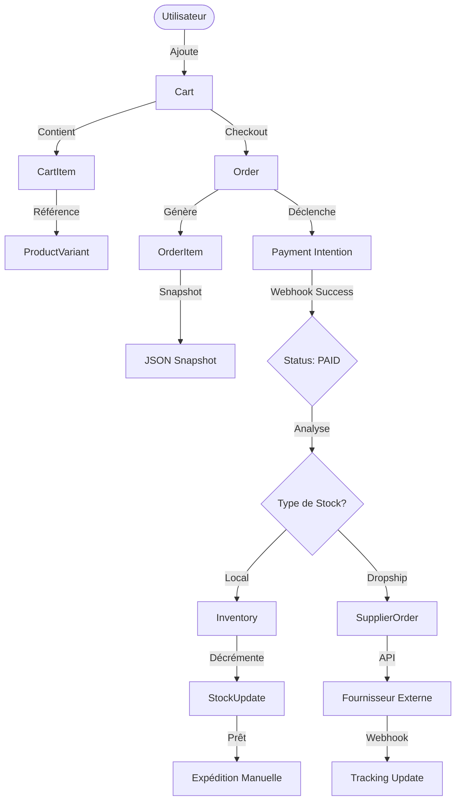
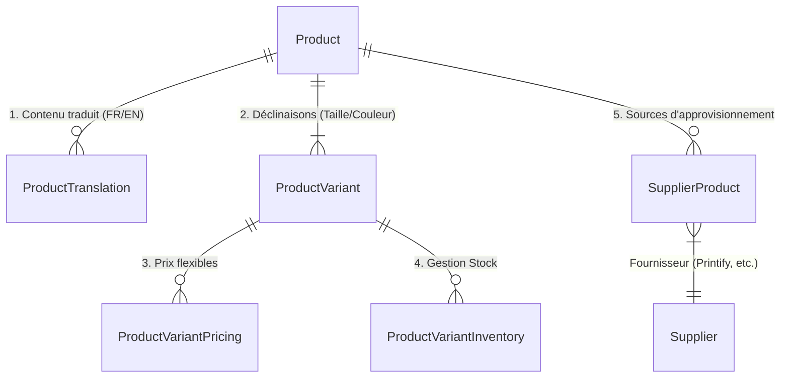

# Architecture & Patterns Base de Données

## 🎯 Philosophie

Cette documentation explique **comment utiliser** notre base de données pour les flux critiques. Pour la définition exacte des tables et champs, référez-vous toujours au fichier source qui est la seule source de vérité :

👉 **[Voir le schéma complet (schema.prisma)](../../prisma/schema.prisma)**

---

## 🔄 Flux de Données Critiques

### 1. Cycle de Vie d'une Commande

Ce diagramme illustre comment les données transitent depuis le panier jusqu'à l'expédition, en gérant le stock local ou le dropshipping.

### 2. Architecture Catalogue (Multi-langue & Multi-source)

Notre catalogue est conçu pour être international par défaut et sourcer des produits de multiples fournisseurs.

---

## ⚡ Index & Performance

Les index suivants sont critiques pour la performance. Si vous modifiez le schéma, assurez-vous de ne pas casser ces chemins d'accès.

| Table | Index | Usage |
|-------|-------|-------|
| `products` | `[slug]` | Accès page produit (Ultra fréquent) |
| `products` | `[status, isFeatured]` | Page d'accueil et listes |
| `product_translations` | `[productId, language]` | Join quasi-systématique en lecture |
| `orders` | `[userId, status]` | Historique commandes client |
| `webhook_events` | `[source, eventId]` | Déduplication des events Stripe (Critique) |

---

## 🛡 Sécurité &Bonnes Pratiques

1.  **Snapshots Commande** : Ne jamais se fier aux données du produit (`Product`) pour afficher une facture historique. Le prix ou le nom a pu changer. Utilisez toujours `OrderItem.productSnapshot`.
2.  **Soft Delete** : On ne supprime (presque) jamais rien. Utilisez `deletedAt` pour les produits ou catégories.
3.  **Adresses Immuables** : Les adresses dans `Order` sont stockées en JSON (`shippingAddress`). Si l'utilisateur change son adresse de profil après coup, la commande historique ne doit pas changer.