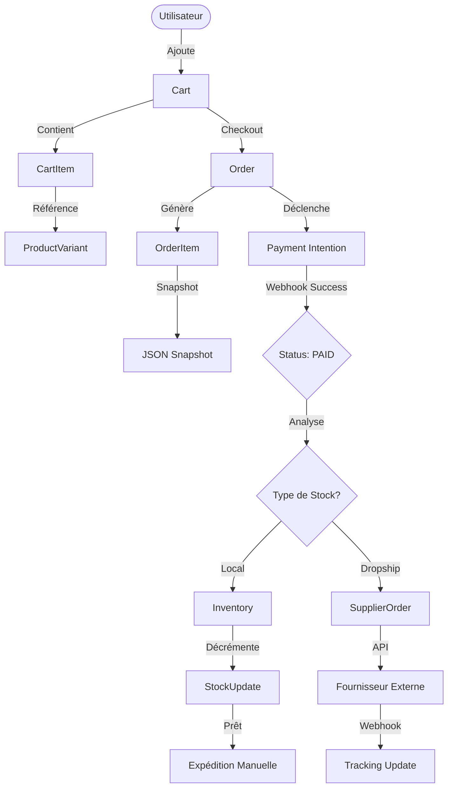
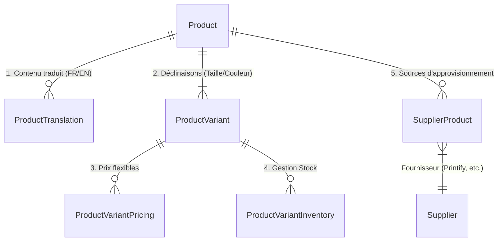

# Architecture & Patterns Base de Données

## 🎯 Philosophie

Cette documentation explique **comment utiliser** notre base de données pour les flux critiques. Pour la définition exacte des tables et champs, référez-vous toujours au fichier source qui est la seule source de vérité :

👉 **[Voir le schéma complet (schema.prisma)](../../prisma/schema.prisma)**

---

## 🔄 Flux de Données Critiques

### 1. Cycle de Vie d'une Commande

Ce diagramme illustre comment les données transitent depuis le panier jusqu'à l'expédition, en gérant le stock local ou le dropshipping.



### 2. Architecture Catalogue (Multi-langue & Multi-source)

Notre catalogue est conçu pour être international par défaut et sourcer des produits de multiples fournisseurs.



---

## 🛠 Patterns d'Usage (Cookbook)

Voici les requêtes Prisma types pour les opérations complexes.

### 📦 Récupérer un Produit Complet (Front-end)

Pour afficher une page produit, nous avons besoin des infos de base, de la traduction correcte, et des variantes actives avec leurs prix.

```typescript
const product = await prisma.product.findUnique({
  where: { slug: 'tshirt-chat' },
  include: {
    // 1. Traduction spécifique à la langue demandée
    translations: {
      where: { language: 'FR' }
    },
    // 2. Variantes avec Prix et Stock
    variants: {
      where: { deletedAt: null },
      include: {
        pricing: {
          where: { isActive: true, priceType: 'base' }
        },
        inventory: {
          select: { stock: true, allowBackorder: true } // Ne pas exposer les données internes
        },
        // 3. Attributs (Couleur: Rouge) resolve les traductions
        attributeValues: {
          include: {
            attributeValue: {
              include: {
                translations: { where: { language: 'FR' } },
                attribute: {
                  include: { translations: { where: { language: 'FR' } } }
                }
              }
            }
          }
        }
      }
    },
    // 4. Images
    media: { orderBy: { sortOrder: 'asc' } }
  }
});
```

### 🛒 Création de Commande (Atomicité)

La création d'une commande doit être transactionnelle : on crée la commande, les items, et on lie le paiement en une seule opération.

```typescript
const order = await prisma.$transaction(async (tx) => {
  // 1. Créer la commande
  const newOrder = await tx.order.create({
    data: {
      userId: user.id,
      orderNumber: generateOrderNumber(),
      totalAmount: cart.total,
      // ...
      items: {
        create: cart.items.map(item => ({
          variantId: item.variantId,
          quantity: item.quantity,
          unitPrice: item.price,
          // CRITIQUE : Snapshot des données produit
          productSnapshot: {
            name: item.productName,
            sku: item.sku
          }
        }))
      }
    }
  });

  // 2. Vider le panier
  await tx.cart.update({
    where: { id: cart.id },
    data: { status: 'CONVERTED' }
  });

  return newOrder;
});
```

### 🔄 Synchronisation Stock (Gestion de Concurrence)

Pour éviter de vendre du stock qui n'existe pas lors de pics de trafic (race condition), utilisez `decrement`.

```typescript
// Mauvaise pratique ❌
// const stock = await getStock();
// await updateStock(stock - 1);

// Bonne pratique ✅ (Atomique au niveau DB)
await prisma.productVariantInventory.update({
  where: { variantId: 'var_123' },
  data: {
    stock: { decrement: quantity },
    reservedStock: { increment: quantity }
  }
});
```

---

## ⚡ Index & Performance

Les index suivants sont critiques pour la performance. Si vous modifiez le schéma, assurez-vous de ne pas casser ces chemins d'accès.

| Table | Index | Usage |
|-------|-------|-------|
| `products` | `[slug]` | Accès page produit (Ultra fréquent) |
| `products` | `[status, isFeatured]` | Page d'accueil et listes |
| `product_translations` | `[productId, language]` | Join quasi-systématique en lecture |
| `orders` | `[userId, status]` | Historique commandes client |
| `webhook_events` | `[source, eventId]` | Déduplication des events Stripe (Critique) |

---

## 🛡 Sécurité &Bonnes Pratiques

1.  **Snapshots Commande** : Ne jamais se fier aux données du produit (`Product`) pour afficher une facture historique. Le prix ou le nom a pu changer. Utilisez toujours `OrderItem.productSnapshot`.
2.  **Soft Delete** : On ne supprime (presque) jamais rien. Utilisez `deletedAt` pour les produits ou catégories.
3.  **Adresses Immuables** : Les adresses dans `Order` sont stockées en JSON (`shippingAddress`). Si l'utilisateur change son adresse de profil après coup, la commande historique ne doit pas changer.