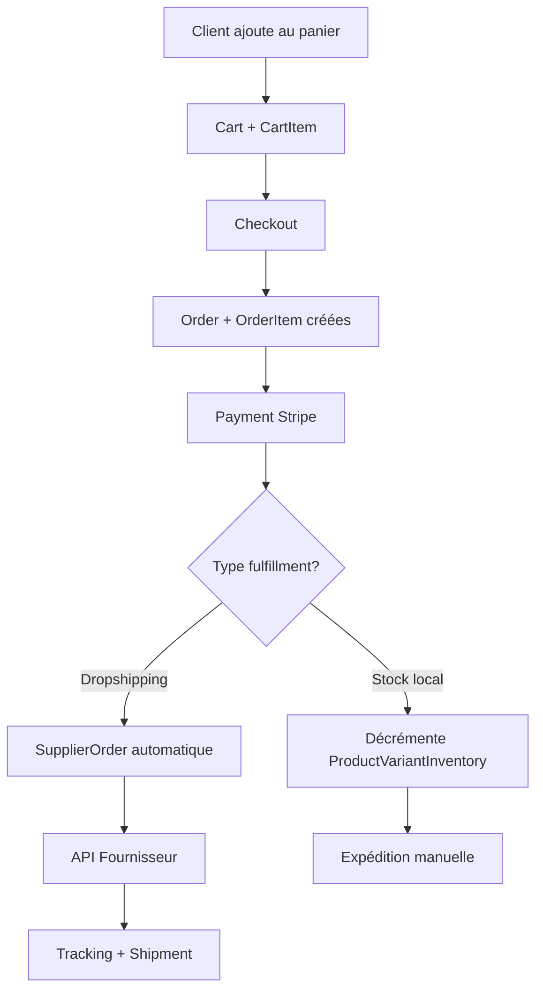

# Documentation Technique - Schéma de Base de Données

## Vue d'ensemble

Cette documentation décrit le schéma de base de données complet pour le starter e-commerce. Le modèle supporte :
- Commerce multi-canal (site web, Etsy, Amazon, eBay)
- Gestion multi-fournisseurs (dropshipping, stock local, print-on-demand)
- Internationalisation (multi-langues, multi-devises)
- Traçabilité complète (audit logs, webhooks)

## Enums et Types

### Rôles et Statuts Utilisateur
```prisma
enum UserRole {
  CLIENT    // Utilisateur standard
  ADMIN     // Administrateur du système
}
```

### Statuts Produits
```prisma
enum ProductStatus {
  DRAFT     // Brouillon, non visible
  ACTIVE    // Actif et visible sur le site
  INACTIVE  // Temporairement désactivé
  ARCHIVED  // Archivé, non supprimé pour historique
}
```

### Statuts Commandes
```prisma
enum OrderStatus {
  PENDING   // En attente de paiement
  PAID      // Payée, en cours de traitement
  SHIPPED   // Expédiée
  DELIVERED // Livrée
  CANCELLED // Annulée
  REFUNDED  // Remboursée
}
```

### Statuts Paiements
```prisma
enum PaymentStatus {
  PENDING   // En attente
  COMPLETED // Complété avec succès
  FAILED    // Échec
  REFUNDED  // Remboursé
  CANCELLED // Annulé
}
```

### Types de Fournisseurs
```prisma
enum SupplierType {
  ETSY         // Plateforme Etsy
  AMAZON       // Amazon FBA/FBM
  EBAY         // Plateforme eBay
  PRINTIFY     // Print-on-demand Printify
  ALIEXPRESS   // Fournisseur AliExpress
  LOCAL_STOCK  // Stock local/propre
  DROPSHIPPER  // Dropshipper générique
  OTHER        // Autre type
}
```

### Types de Fulfillment
```prisma
enum FulfillmentType {
  DROPSHIPPING     // Expédition directe fournisseur → client
  LOCAL_STOCK      // Expédition depuis stock local
  PRINT_ON_DEMAND  // Impression à la demande
  HYBRID           // Combinaison de plusieurs méthodes
}
```

## Tables Principales

### 1. Gestion des Utilisateurs

#### User
Table centrale des utilisateurs intégrée avec Clerk.

**Champs principaux :**
- `clerkId`: Identifiant unique Clerk (synchronisation externe)
- `email`: Email unique de l'utilisateur
- `role`: Rôle dans le système (CLIENT/ADMIN)

**Relations :**
- `addresses[]`: Adresses de livraison/facturation
- `carts[]`: Paniers (multiples pour historique)
- `orders[]`: Commandes passées
- `reviews[]`: Avis produits

**Exemple de requête :**
```typescript
// Récupérer un utilisateur avec ses adresses
const user = await prisma.user.findUnique({
  where: { clerkId: "user_123" },
  include: {
    addresses: {
      where: { isDefault: true }
    }
  }
})
```

#### Address
Gestion des adresses multiples par utilisateur.

**Types d'adresses :**
- `BILLING`: Facturation uniquement
- `SHIPPING`: Livraison uniquement  
- `BOTH`: Facturation et livraison

**Index optimisés :**
- `[userId, type]`: Recherche par type d'adresse
- `[userId, isDefault]`: Adresse par défaut

### 2. Catalogue Produits

#### Product
Table principale des produits vendus.

**Champs métier :**
- `slug`: URL-friendly unique
- `status`: Visibilité et état du produit
- `isFeatured`: Produit mis en avant
- `sortOrder`: Ordre d'affichage

**Relations complexes :**
- `translations[]`: Noms/descriptions multilingues
- `variants[]`: Variantes (taille, couleur, etc.)
- `categories[]`: Catégories (many-to-many)
- `supplierProducts[]`: Sources d'approvisionnement

**Exemple de requête :**
```typescript
// Produits actifs avec leurs variantes et prix
const products = await prisma.product.findMany({
  where: { 
    status: 'ACTIVE',
    deletedAt: null
  },
  include: {
    translations: {
      where: { language: 'FR' }
    },
    variants: {
      include: {
        pricing: {
          where: { 
            priceType: 'base',
            isActive: true
          }
        },
        inventory: true
      }
    }
  }
})
```

#### ProductVariant
Variantes de produits (taille, couleur, matériau).

**Séparation des préoccupations :**
- `ProductVariantPricing`: Gestion flexible des prix
- `ProductVariantInventory`: Stock et seuils
- `ProductVariantAttributeValue`: Attributs (couleur=rouge)

#### ProductAttribute + ProductAttributeValue
Système d'attributs flexible et multilingue.

**Structure :**
```
ProductAttribute (color)
├── ProductAttributeTranslation (FR: "Couleur", EN: "Color")
└── ProductAttributeValue (red)
    └── ProductAttributeValueTranslation (FR: "Rouge", EN: "Red")
```

### 3. Gestion des Commandes

#### Order
Commande client avec calculs complets.

**Montants calculés :**
- `subtotalAmount`: Sous-total produits
- `taxAmount`: Taxes applicables
- `shippingAmount`: Frais de port
- `discountAmount`: Remises appliquées
- `totalAmount`: Total final

**Adresses JSON :**
Les adresses sont stockées en JSON pour préserver l'état au moment de la commande.

**Exemple de requête :**
```typescript
// Commandes avec items et paiements
const orders = await prisma.order.findMany({
  where: { 
    userId: "user_123",
    status: { in: ['PAID', 'SHIPPED'] }
  },
  include: {
    items: {
      include: {
        variant: {
          include: {
            product: {
              include: {
                translations: {
                  where: { language: 'FR' }
                }
              }
            }
          }
        }
      }
    },
    payments: true,
    supplierOrders: true
  }
})
```

#### OrderItem
Items individuels avec snapshot pour historique.

**productSnapshot :** JSON contenant l'état du produit au moment de la commande (prix, nom, description) pour préserver l'historique même si le produit change.

### 4. Système de Fournisseurs

#### Supplier
Fournisseurs et plateformes de vente.

**Configuration API :**
- `apiKey`, `apiSecret`: Credentials pour intégrations
- `apiEndpoint`: URL de base de l'API

**Configuration métier :**
- `minimumOrderAmount`: Commande minimum
- `defaultShippingDays`: Délai standard

#### SupplierProduct
Catalogue des produits disponibles chez les fournisseurs.

**Synchronisation :**
- `lastSyncAt`: Dernière synchronisation
- `syncStatus`: État de la sync (pending/synced/error)
- `syncErrors`: Détails des erreurs

**Mapping produits :**
- `productId`: Lien optionnel vers votre Product
- `supplierSku`: SKU chez le fournisseur

**Exemple de requête :**
```typescript
// Trouver les fournisseurs pour un produit
const suppliers = await prisma.supplierProduct.findMany({
  where: { 
    productId: "prod_123",
    isAvailable: true
  },
  include: {
    supplier: true
  },
  orderBy: {
    supplierPrice: 'asc' // Moins cher en premier
  }
})
```

#### SupplierOrder
Commandes passées aux fournisseurs.

**Workflow dropshipping :**
1. Client commande → `Order` créée
2. Système trouve le fournisseur → `SupplierOrder` créée automatiquement
3. API fournisseur → `supplierOrderNumber` retourné
4. Tracking → `trackingCode` mis à jour

**Exemple de requête :**
```typescript
// Créer une commande fournisseur
const supplierOrder = await prisma.supplierOrder.create({
  data: {
    supplierId: "supplier_printify",
    orderId: "order_123",
    internalOrderNumber: "SO-001",
    fulfillmentType: 'DROPSHIPPING',
    shippingAddress: customerAddress,
    subtotalAmount: 25.99,
    totalAmount: 25.99,
    currency: 'CAD',
    items: {
      create: [{
        supplierSku: "tshirt_red_M",
        productName: "T-shirt Rouge M",
        quantity: 1,
        unitPrice: 25.99,
        totalPrice: 25.99,
        currency: 'CAD'
      }]
    }
  }
})
```

### 5. Panier et E-commerce

#### Cart
Support panier invité et utilisateur connecté.

**Flexibilité :**
- `userId`: NULL pour invités
- `anonymousId`: Cookie pour invités
- `expiresAt`: Nettoyage automatique

#### Payment + Shipment
Gestion complète paiements et expéditions avec tracking.

## Relations et Flux de Données

### Flux de Commande Standard



### Relations Clés

**Produit vers Vente :**
```
Product → ProductVariant → OrderItem → Order
Product → SupplierProduct → SupplierOrder
```

**Utilisateur vers Commande :**
```
User → Cart → Order → Payment
User → Address → Order.shippingAddress (JSON)
```

**Multilingue :**
```
Product → ProductTranslation[language]
Category → CategoryTranslation[language]
```

## Index et Performance

### Index Critiques

**Recherche produits :**
```sql
-- Produits actifs et featured
CREATE INDEX idx_products_status_featured ON products(status, is_featured);

-- Recherche par slug
CREATE INDEX idx_products_slug ON products(slug);
```

**Commandes utilisateur :**
```sql
-- Commandes par utilisateur et statut
CREATE INDEX idx_orders_user_status ON orders(user_id, status, created_at);
```

**Synchronisation fournisseurs :**
```sql
-- Produits à synchroniser
CREATE INDEX idx_supplier_products_sync ON supplier_products(supplier_id, sync_status);
```

### Requêtes d'Optimisation

**Nettoyage paniers expirés :**
```typescript
// Job quotidien
await prisma.cart.deleteMany({
  where: {
    status: 'ABANDONED',
    expiresAt: {
      lt: new Date()
    }
  }
})
```

**Stock bas :**
```typescript
// Alertes stock
const lowStock = await prisma.productVariantInventory.findMany({
  where: {
    stock: {
      lte: prisma.productVariantInventory.fields.lowStockThreshold
    },
    trackInventory: true
  },
  include: {
    variant: {
      include: {
        product: {
          include: {
            translations: {
              where: { language: 'FR' }
            }
          }
        }
      }
    }
  }
})
```

## Patterns d'Usage

### 1. Création de Produit Complet
```typescript
const product = await prisma.product.create({
  data: {
    slug: 'tshirt-chat-mignon',
    status: 'ACTIVE',
    translations: {
      create: [
        {
          language: 'FR',
          name: 'T-shirt Chat Mignon',
          description: 'Adorable t-shirt avec chat'
        },
        {
          language: 'EN', 
          name: 'Cute Cat T-shirt',
          description: 'Adorable t-shirt with cat'
        }
      ]
    },
    variants: {
      create: [
        {
          sku: 'TSHIRT_CAT_M',
          pricing: {
            create: {
              price: 24.99,
              currency: 'CAD'
            }
          },
          inventory: {
            create: {
              stock: 100,
              lowStockThreshold: 10
            }
          }
        }
      ]
    }
  }
})
```

### 2. Processus de Commande
```typescript
// 1. Finaliser le panier
const order = await prisma.order.create({
  data: {
    userId: 'user_123',
    orderNumber: 'ORD-2024-001',
    // ... montants calculés
    items: {
      create: cartItems.map(item => ({
        variantId: item.variantId,
        quantity: item.quantity,
        unitPrice: item.variant.pricing[0].price,
        // productSnapshot avec état actuel
      }))
    }
  }
})

// 2. Traitement selon fulfillment
for (const item of order.items) {
  const supplierProduct = await findBestSupplier(item.variantId)
  
  if (supplierProduct.fulfillmentType === 'DROPSHIPPING') {
    await createSupplierOrder(supplierProduct, item)
  } else {
    await decrementInventory(item.variantId, item.quantity)
  }
}
```

### 3. Synchronisation Fournisseur
```typescript
async function syncSupplierCatalog(supplierId: string) {
  const supplier = await prisma.supplier.findUnique({
    where: { id: supplierId }
  })
  
  // Appel API fournisseur
  const supplierProducts = await fetchFromSupplierAPI(supplier)
  
  // Upsert produits
  for (const item of supplierProducts) {
    await prisma.supplierProduct.upsert({
      where: {
        supplierId_supplierSku: {
          supplierId,
          supplierSku: item.sku
        }
      },
      update: {
        supplierPrice: item.price,
        stock: item.stock,
        lastSyncAt: new Date(),
        syncStatus: 'synced'
      },
      create: {
        supplierId,
        supplierSku: item.sku,
        supplierTitle: item.title,
        supplierPrice: item.price,
        // ... autres champs
      }
    })
  }
}
```

## Considérations de Sécurité

### Données Sensibles
- `Supplier.apiKey/apiSecret`: Chiffrement recommandé
- `Payment.transactionData`: Données PCI-DSS
- `AuditLog`: Traçabilité complète des actions

### Soft Deletes
- `Product.deletedAt`: Suppression logique
- `Category.deletedAt`: Préservation des relations

### Webhooks
- `WebhookEvent`: Déduplication et retry automatique
- Signature verification pour sécurité

Ce schéma offre une base solide pour un e-commerce multi-canal avec gestion complète des fournisseurs et excellent support de l'internationalisation.