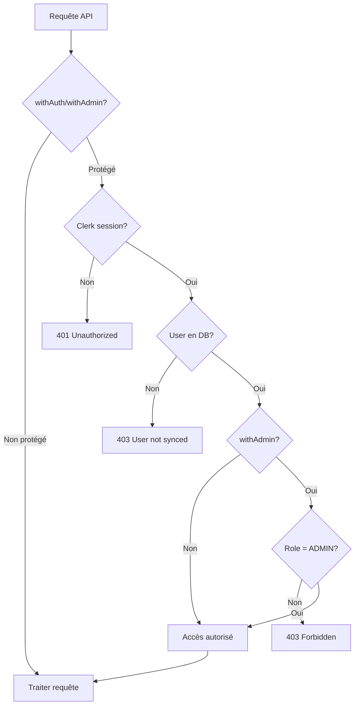

# 🔒 RBAC - Role-Based Access Control

## Vue d'ensemble

Système de contrôle d'accès basé sur les rôles pour protéger les routes API et les pages de l'application.

**Rôles disponibles :**
- `CLIENT` : Utilisateur standard
- `ADMIN` : Administrateur avec accès complet

---

## Middlewares de sécurité

### withAuth()

Protège les routes nécessitant une authentification (n'importe quel utilisateur connecté).

**Utilisation :**
```typescript
import { withAuth } from '@/lib/middleware/withAuth';

async function handler(request: Request, authContext: AuthContext) {
  // authContext contient: userId, clerkId, email, role
  return NextResponse.json({ user: authContext });
}

export const GET = withError(withAuth(handler));
```

**Codes de réponse :**
- `401 Unauthorized` : Aucun utilisateur connecté
- `403 Forbidden` : Utilisateur Clerk non synchronisé en DB
- `200 OK` : Accès autorisé

### withAdmin()

Protège les routes réservées aux administrateurs uniquement.

**Utilisation :**
```typescript
import { withAdmin } from '@/lib/middleware/withAuth';

async function adminHandler(request: Request, authContext: AuthContext) {
  // Seuls les ADMIN peuvent accéder ici
  return NextResponse.json({ data: 'Admin data' });
}

export const POST = withError(withAdmin(adminHandler));
```

**Codes de réponse :**
- `401 Unauthorized` : Aucun utilisateur connecté
- `403 Forbidden` : Utilisateur connecté mais rôle != ADMIN
- `200 OK` : Admin autorisé

---

## Tableau des routes protégées

### Routes API Publiques

| Route | Méthode | Protection | Rôle requis | Description |
|-------|---------|------------|-------------|-------------|
| `/api/products` | GET | ❌ Publique | - | Liste des produits |
| `/api/products/[slug]` | GET | ❌ Publique | - | Détail d'un produit |
| `/api/categories` | GET | ❌ Publique | - | Liste des catégories |
| `/api/categories/[slug]` | GET | ❌ Publique | - | Détail d'une catégorie |
| `/api/webhooks/clerk` | POST | ❌ Publique* | - | Webhook Clerk (*signature vérifiée) |
| `/api/internal/health` | GET | ❌ Publique | - | Health check |

### Routes API Admin (protégées)

| Route | Méthode | Protection | Rôle requis | Description |
|-------|---------|------------|-------------|-------------|
| `/api/users` | GET | ✅ `withAdmin` | ADMIN | Liste tous les utilisateurs |
| `/api/users/[id]/promote` | POST | ✅ `withAdmin` | ADMIN | Changer le rôle d'un utilisateur |
| `/api/admin/products` | POST | ✅ `withAdmin` | ADMIN | Créer un produit |
| `/api/admin/products/[id]` | GET | ✅ `withAdmin` | ADMIN | Récupérer produit (tous statuts) |
| `/api/admin/products/[id]` | PUT | ✅ `withAdmin` | ADMIN | Modifier un produit |
| `/api/admin/products/[id]` | DELETE | ✅ `withAdmin` | ADMIN | Supprimer un produit |
| `/api/admin/attributes` | GET/POST | ✅ `withAdmin` | ADMIN | Gestion des attributs |
| `/api/admin/attributes/[id]/values` | POST | ✅ `withAdmin` | ADMIN | Ajouter valeur attribut |

### Routes futures (à protéger)

| Route | Protection prévue | Rôle |
|-------|------------------|------|
| `/api/admin/categories` | `withAdmin` | ADMIN |
| `/api/admin/orders` | `withAdmin` | ADMIN |
| `/api/cart` | `withAuth` | CLIENT/ADMIN |
| `/api/orders` | `withAuth` | CLIENT/ADMIN |
| `/api/orders/[id]` | `withAuth` + ownership | CLIENT/ADMIN |

---

## Exemples de test

### Test avec Postman

**1. Test route publique (OK)**
```bash
GET http://localhost:3000/api/products
# Réponse: 200 OK
```

**2. Test route admin sans auth (401)**
```bash
GET http://localhost:3000/api/users
# Réponse: 401 Unauthorized
# { "error": "Unauthorized", "message": "Authentication required" }
```

**3. Test route admin avec CLIENT (403)**
```bash
# Se connecter comme CLIENT dans Clerk
GET http://localhost:3000/api/users
# Réponse: 403 Forbidden
# { "error": "Forbidden", "message": "Admin access required" }
```

**4. Test route admin avec ADMIN (200)**
```bash
# Se connecter comme ADMIN dans Clerk
GET http://localhost:3000/api/users
# Réponse: 200 OK avec liste des utilisateurs
```

### Test avec curl

```bash
# Sans session Clerk (401)
curl http://localhost:3000/api/users

# Avec session Clerk (besoin de cookies)
curl -H "Cookie: __session=..." http://localhost:3000/api/users
```

---

## Logs de sécurité

Tous les accès sont journalisés avec des niveaux appropriés :

**Accès autorisé (INFO) :**
```json
{
  "level": "info",
  "action": "authenticated_request",
  "userId": "cmgbhqatv0009ksct1u1dq1vy",
  "role": "ADMIN"
}
```

**Tentative non authentifiée (WARN) :**
```json
{
  "level": "warn",
  "action": "unauthorized_access_attempt",
  "path": "/api/users"
}
```

**Accès refusé (WARN) :**
```json
{
  "level": "warn",
  "action": "forbidden_access_attempt",
  "userId": "cmgbhqb0p000kksct4ik306p8",
  "role": "CLIENT",
  "requiredRole": "ADMIN"
}
```

**Erreur de synchronisation (ERROR) :**
```json
{
  "level": "error",
  "action": "user_not_found_in_db",
  "clerkId": "user_abc123"
}
```

---

## Workflow d'authentification



---

## Bonnes pratiques

### 1. Ordre des middlewares

Toujours appliquer `withError` en dernier :

```typescript
// ✅ Correct
export const POST = withError(withAdmin(handler));

// ❌ Incorrect
export const POST = withAdmin(withError(handler));
```

### 2. AuthContext dans les handlers

Le contexte d'authentification est passé en dernier paramètre :

```typescript
async function handler(
  request: Request,
  { params }: { params: Promise<{ id: string }> },
  authContext: AuthContext  // Ajouté par withAuth/withAdmin
) {
  console.log(authContext.userId);
  console.log(authContext.role);
}
```

### 3. Vérification de propriété

Pour les ressources utilisateur (commandes, panier), vérifier la propriété :

```typescript
async function getOrder(
  request: Request,
  { params }: { params: Promise<{ id: string }> },
  authContext: AuthContext
) {
  const { id } = await params;
  const order = await prisma.order.findUnique({ where: { id } });
  
  // CLIENT peut voir seulement ses commandes
  if (authContext.role === 'CLIENT' && order.userId !== authContext.userId) {
    return NextResponse.json({ error: 'Forbidden' }, { status: 403 });
  }
  
  // ADMIN peut tout voir
  return NextResponse.json({ data: order });
}

export const GET = withError(withAuth(getOrder));
```

### 4. Routes publiques vs privées

**Routes publiques** (pas de middleware) :
- Listing produits/catégories
- Détail produit/catégorie
- Health checks
- Webhooks (avec vérification de signature)

**Routes authentifiées** (`withAuth`) :
- Panier utilisateur
- Commandes utilisateur
- Profil utilisateur

**Routes admin** (`withAdmin`) :
- Gestion utilisateurs
- CRUD produits/catégories
- Vue globale commandes
- Dashboard admin

---

## Fichiers sources

- Middlewares : [src/lib/middleware/withAuth.ts](file:///home/ulbo/Dev/ecommerce-starter-v2/src/lib/middleware/withAuth.ts)
- Exemple protégé : [src/app/api/users/route.ts](file:///home/ulbo/Dev/ecommerce-starter-v2/src/app/api/users/route.ts)
- Exemple promote : [src/app/api/users/[id]/promote/route.ts](file:///home/ulbo/Dev/ecommerce-starter-v2/src/app/api/users/[id]/promote/route.ts)

---

## Tests automatisés (à venir)

```typescript
// tests/api/auth.test.ts
describe('RBAC', () => {
  it('should block unauthenticated access to /api/users', async () => {
    const res = await fetch('/api/users');
    expect(res.status).toBe(401);
  });

  it('should block CLIENT access to /api/users', async () => {
    const res = await fetch('/api/users', {
      headers: { Cookie: clientSessionCookie },
    });
    expect(res.status).toBe(403);
  });

  it('should allow ADMIN access to /api/users', async () => {
    const res = await fetch('/api/users', {
      headers: { Cookie: adminSessionCookie },
    });
    expect(res.status).toBe(200);
  });
});
```

---

## Prochaines étapes

1. ✅ Middlewares créés (`withAuth`, `withAdmin`)
2. ✅ Routes sensibles protégées (`/api/users`, `/api/users/[id]/promote`)
3. ⏳ Protéger les futures routes admin (produits, catégories, commandes)
4. ⏳ Ajouter tests automatisés E2E
5. ⏳ Implémenter protection UI (masquer liens admin pour CLIENT)
6. ⏳ Ajouter rate limiting sur routes sensibles
