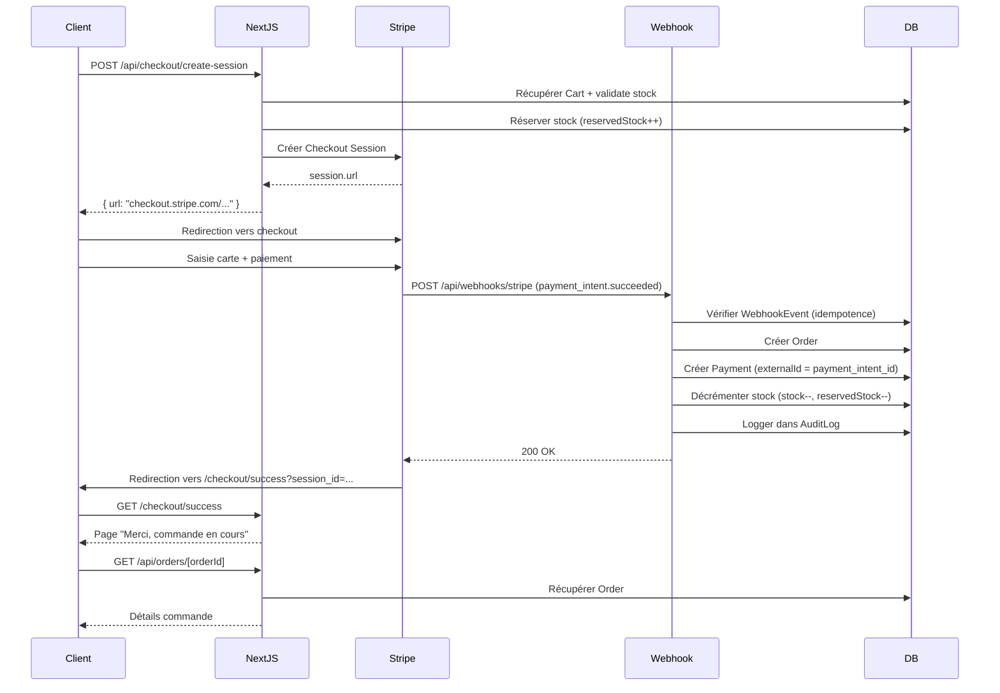

# 🏗️ Architecture Stripe

## 📂 Structure des fichiers

```
src/
├── app/api/
│   ├── checkout/
│   │   ├── create-session/
│   │   │   └── route.ts           # POST - Créer session Stripe
│   │   └── success/
│   │       └── route.ts           # GET - Redirection après paiement
│   ├── webhooks/
│   │   └── stripe/
│   │       └── route.ts           # POST - Recevoir événements Stripe
│   └── orders/
│       └── [orderId]/
│           └── route.ts           # GET - Récupérer commande client
│
└── lib/
    ├── stripe/
    │   ├── client.ts              # Singleton Stripe SDK
    │   ├── checkout.ts            # Logique création session
    │   ├── webhooks.ts            # Handlers événements
    │   └── payments.ts            # Utilitaires paiements
    ├── services/
    │   ├── cart.service.ts        # Existe déjà
    │   ├── order.service.ts       # Créer/gérer commandes
    │   └── inventory.service.ts   # Réserver/décrémenter stock
    └── utils/
        ├── currency.ts            # Formatage CAD/USD
        └── validation.ts          # Schémas Zod
```

## 🔄 Flow de paiement complet



## 🗄️ Schéma de données

### Création d'une commande après paiement réussi

```typescript
// Dans webhook handler (payment_intent.succeeded)
{
  Order: {
    orderNumber: "ORD-2025-0001",
    userId: "user_xxx",
    status: "PAID",
    totalAmount: 99.99,
    items: [...],
    payments: [
      {
        method: "STRIPE",
        status: "COMPLETED",
        externalId: "pi_xxx",  // payment_intent_id
        amount: 99.99
      }
    ]
  },
  WebhookEvent: {
    source: "stripe",
    eventId: "evt_xxx",
    eventType: "payment_intent.succeeded",
    processed: true,
    payloadHash: "sha256_hash"  // Éviter doublons
  }
}
```

## 🔒 Sécurité

### 1. Validation signature webhook
```typescript
// lib/stripe/webhooks.ts
const signature = headers.get('stripe-signature');
const event = stripe.webhooks.constructEvent(
  body,
  signature,
  process.env.STRIPE_WEBHOOK_SECRET
);
```

### 2. Idempotence
```typescript
// Vérifier si événement déjà traité
const existingEvent = await prisma.webhookEvent.findUnique({
  where: { source_eventId: { source: 'stripe', eventId: event.id } }
});
if (existingEvent?.processed) {
  return; // Déjà traité, skip
}
```

### 3. Rate limiting
```typescript
// Sur /api/checkout/create-session
withRateLimit({ windowMs: 60000, max: 10 })
```

## 🎯 Points critiques

### ⚠️ JAMAIS faire confiance au client

❌ **Mauvais** : Créer la commande depuis le client après paiement
```typescript
// ❌ NE PAS FAIRE
onSuccess={() => {
  fetch('/api/orders', { method: 'POST' }) // Pas sécurisé!
}}
```

✅ **Bon** : Créer la commande dans le webhook
```typescript
// ✅ FAIRE
// webhook handler
case 'payment_intent.succeeded':
  await createOrderFromPayment(paymentIntent)
```

### 📦 Gestion du stock

```typescript
// 1. Lors de la création de la session checkout
await reserveStock(cartItems) // reservedStock++

// 2. Si paiement réussi (webhook)
await decrementStock(cartItems) // stock--, reservedStock--

// 3. Si paiement échoué/expiré (webhook)
await releaseStock(cartItems) // reservedStock--
```

## 🧪 Tests

Cartes de test Stripe :
- ✅ Succès : `4242 4242 4242 4242`
- ❌ Échec : `4000 0000 0000 0002`
- 🔐 3D Secure : `4000 0025 0000 3155`

Voir [testing.md](./testing.md) pour plus de détails.
